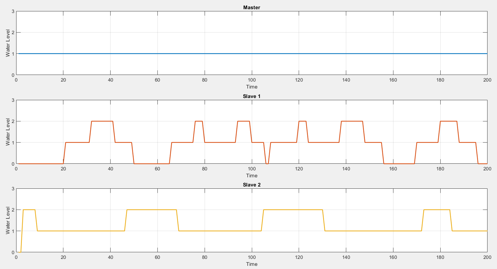

# Water_Tanks_Network_Control_System
This thesis presents a comprehensive project involving the management of three water tanks, treated first with a centralized control system and subsequently with a decentralized control system.

In particular the project is divided in the following parts:
- Physical model and its Components
- System and Network Set-Up.
- Centralized Algorithm.
- Distributed Algorithm.

The complete report is available [here](.Water_Tanks_Network_Control_System.pdf).

## Physical model and its Components
The physical model is composed by three interconnected water tanks and an Arduino system.
### Physical model:
The three water tanks are disposed as follows:
<div align="center">
  
</div>
The tray in the center is raised 14 cm above the others thanks to a specially built support. The former is connected to each of the others by a manual valve, made by a syringe of 11 mm diameter.

### Electronic Components
The Arduino system is made up of:
#### MKR 1000 WiFi
#### Water Sensors
#### Pump System including Pump, Relay Shield and an Amplifier Circuit
#### Other components: Resistance, Diode and 12 V Battery
The components are connected as follows:
<div align="center">
  
</div>
Each water represents a node of the network and it is characterized by an Arduino MKR1000 board connected to a different computer. Each computer collects the measurements acquired from the water sensor linked to its tank. The bottoms tanks include also the Pump system. 
<div align="center">
  
</div>

## System and Network Set-up
### Sensors Calibration
Before each simulations, the water sensors need to be calibrated. In particular each Sensor is divided into three areas: High, Medium and Low.

### Wifi Connection
In order to create a connection between the nodes, it is necessary to connect them all to the same WiFi. In this project, it was used the IP address method of communication because it offers significant benefits in terms of ease of integration and data management.

## Centralized Algorithm
For the Centralized Algorithm, the upper tank was chosen as master node while the bottom ones were selected as slaves. The master node received the water sensor’s measurements from the slaves and, based on these information, it decided whether or not to activate the pumps located in the lower tanks. In this case, this happens whenever the sensor of the master reads a different value rather than High and one of the lower tank’s sensor had a higher value than the master level and, in another simulation, to ensure that the master level remained at a reference value.
### Delay Time 
The period to acquire and send data is set as follows for the nodes: 
- 1s for the first slave
- 2s for the second
- 0.5s for the master
<div align="center">

</div>

### Constant Reference Control
The master node had to remain at a constant reference value:
<div align="center">

</div>

## Distributed Algorithm
Distributed Algorithms, where the three nodes involved are in a configuration where the upper node (tank) communicates with the bottom nodes (tanks), while the bottom nodes just communicate with the upper one. The overall measurements will be collected offline through a .txt file. Note that the sensors were not all calibrated perfectly in the same way and, therefore, the overall average did not remain constant and, consequently, the nodes reached 3 Consensus values in 3 different moments.
### Dynamic Consensus Algorithm 
The Dynamic Consensus algorithm is a protocol used to achieve agreement on a single data value among distributed processes or systems. Its primary purpose is to ensure that all nodes in a network converge to a common state or value. 
```math
\begin{aligned}
x_i(k+1) = x_i(k) - \epsilon \left( \sum_{j \in J} a_{ij} (x_i(k) - x_j(k)) \right) + x(k+1) - z(k)
\end{aligned}
```
#### Healthy Network
<div align="center">

</div>
<div align="center">

</div>

#### Simulation of a Fallen Node
It was simulated a node was dropped mid-execution.
<div align="center">

</div>
<div align="center">

</div>
In this case, the nodes reaching Consensus on the total average until one of them felt and then adapting the new Consensus to the value of the fallen node.

### Weighted Dynamic Consensus Algorithm 
The Weighted Dynamic Consensus Algorithm introduces various weights $w_i$ for the nodes to account for differences in their importance or reliability giving a higher weight to the better nodes. This modification allows the system to converge to a consensus that better reflects the weighted contributions of each node.
```math
\begin{aligned}
x_i(k+1) = x_i(k) - \epsilon \left( \frac{1}{w_i} \sum_{j \in J} a_{ij} (x_i(k) - x_j(k)) \right) + x(k+1) - z(k)
\end{aligned}
```

#### Healthy Network
<div align="center">

</div>
<div align="center">

</div>
